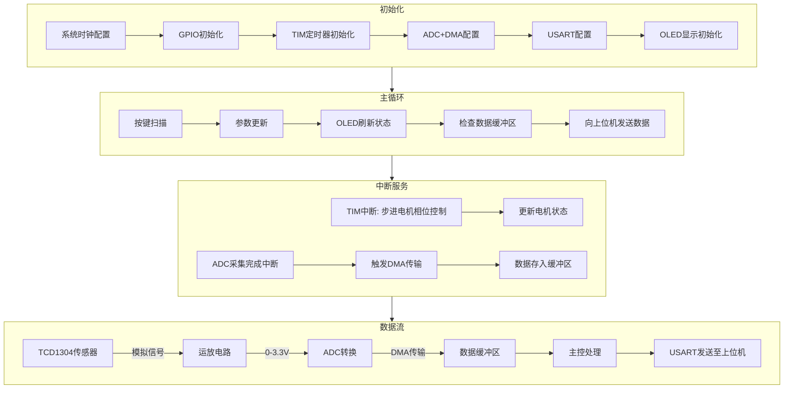

**系统实现最简要需求：**

1. **硬件组成**：

   - 主控：STM32F103C8T6
   - 传感器：TCD1304（光信号采集，需电平转换和运放电路适配 ADC 范围）
   - 驱动模块：ULN2003（步进电机控制，半步驱动）
   - 通信模块：USART（RS232 电平转换，光源亮度控制）
   - 人机交互：OLED + 按键（参数配置与状态显示）
   - 电源：3.3V（主控/传感器）、5V（步进电机/OLED）

2. **核心功能**：
   - 高精度光信号采集（TCD1304 时序控制 + ADC + DMA 传输）
   - 步进电机匀速移动（TIM 定时器中断 + 相位表控制）
   - 上位机通信（USART 协议传输数据）
   - 实时人机交互（OLED 显示系统状态，按键调整参数）

---

**软件设计结构：**

**说明：**

1. **初始化**：配置硬件外设，确保传感器、电机、通信模块就绪。
2. **主循环**：处理用户输入（按键）、更新显示，并持续向上位机发送数据。
3. **中断服务**：
   - **TIM 中断**：精确控制步进电机相位，实现匀速运动。
   - **ADC 中断**：DMA 自动传输传感器数据，减少 CPU 占用。
4. **数据流**：光信号经运放适配后，由 ADC 采集并通过 DMA 存储，最终通过 USART 上传。

**复现关键点：**

- 使用硬件定时器（TIM）生成 TCD1304 驱动信号（SH、ICG、ϕM），确保时序严格匹配。
- ADC 配置为连续扫描模式，DMA 自动搬运数据至内存，避免 CPU 阻塞。
- 步进电机驱动采用 8 拍相位表，通过 TIM 中断切换相位，实现半步驱动。
- USART 通信需遵循自定义协议（特征字+命令字+数据+校验），确保与上位机兼容。
- 电源模块需隔离数字与模拟部分，减少噪声干扰。

**注意事项：**

- 高频信号线（如 TCD1304 时钟）需使用屏蔽线或缩短走线长度，降低电磁干扰。
- 步进电机驱动电流较大，需单独供电并增加续流二极管保护电路。
- 软件中需加入去抖逻辑处理按键输入，避免误触发。
