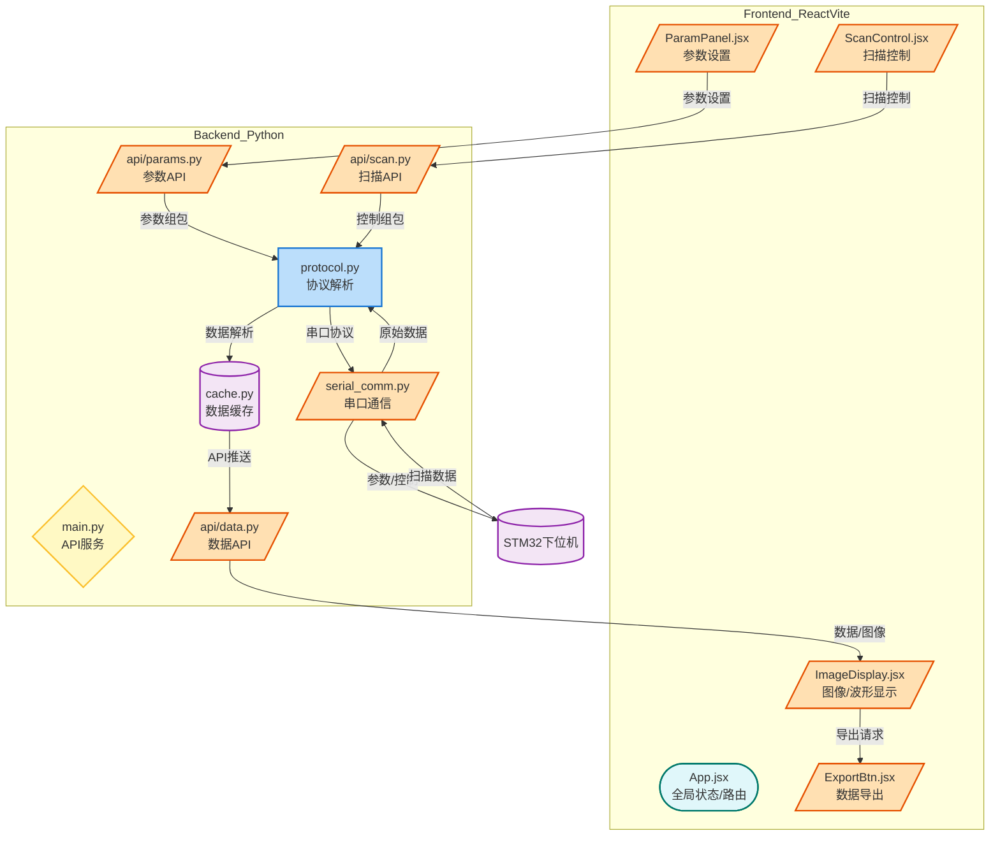

### 系统实现最简要需求总结

1. **硬件组成**
   - **主控芯片**：STM32F103C8T6
   - **传感器**：TCD1304（线性CCD，需电平转换与运放电路适配ADC）
   - **步进电机驱动**：ULN2003，采用半步驱动
   - **通信模块**：USART（带RS232电平转换），用于与上位机通信及光源亮度控制
   - **人机交互**：OLED显示屏与按键（参数配置与状态显示）
   - **电源**：3.3V（主控/传感器），5V（步进电机/OLED）

2. **核心功能**
   - 高精度光信号采集（TCD1304时序控制 + ADC + DMA传输）
   - 步进电机匀速移动（TIM定时器中断 + 相位表控制）
   - 上位机通信（USART协议传输数据）
   - 实时人机交互（OLED显示系统状态，按键调整参数）

3. **关键技术点**
   - 使用TIM定时器生成TCD1304驱动信号（SH、ICG、ϕM），确保时序精确
   - ADC配置为连续扫描模式，DMA自动搬运数据，避免CPU阻塞
   - 步进电机驱动采用8拍相位表，通过TIM中断切换相位，实现半步驱动
   - USART通信需遵循自定义协议（特征字+命令字+数据+校验），确保与上位机兼容
   - 电源模块需隔离数字与模拟部分，减少噪声干扰

4. **注意事项**
   - 高频信号线（如TCD1304时钟）需屏蔽或缩短走线，降低电磁干扰
   - 步进电机驱动电流大，需单独供电并加续流二极管保护
   - 软件需对按键输入做去抖处理，避免误触发

---

### 软件设计结构（Mermaid）

````mermaid
flowchart TB
    subgraph 初始化
        A[系统时钟配置] --> B[GPIO初始化]
        B --> C[TIM定时器初始化]
        C --> D[ADC+DMA配置]
        D --> E[USART配置]
        E --> F[OLED显示初始化]
    end

    subgraph 主循环
        G[按键扫描] --> H[参数更新]
        H --> I[OLED刷新状态]
        I --> J[检查数据缓冲区]
        J --> K[向上位机发送数据]
    end

    subgraph 中断服务
        L[TIM中断: 步进电机相位控制] --> M[更新电机状态]
        N[ADC采集完成中断] --> O[触发DMA传输]
        O --> P[数据存入缓冲区]
    end

    subgraph 数据流
        Q[TCD1304传感器] -->|模拟信号| R[运放电路]
        R -->|0-3.3V| S[ADC转换]
        S -->|DMA传输| T[数据缓冲区]
        T --> U[主控处理]
        U --> V[USART发送至上位机]
    end

    初始化 --> 主循环
    主循环 --> 中断服务
    中断服务 --> 数据流
````

实现方案如下：

---

## 上位机前后端实现方案（React+Vite+Python）

### 1. 总体架构

- **前端**：使用 React + Vite 实现，负责参数配置、扫描控制、数据显示与图像绘制。
- **后端**：使用 Python（如 FastAPI 或 Flask），负责串口通信、数据解析、协议处理、数据缓存与API服务。

---

### 2. 前端功能模块

- **参数设置界面**：配置扫描电平、曝光时间、步进速度等参数。
- **扫描控制界面**：启动/停止扫描，显示当前状态。
- **图像显示界面**：实时绘制扫描波形、显示图像数据。
- **数据导出**：支持导出扫描数据或图像。

---

### 3. 后端功能模块

- **串口通信服务**：与下位机通信，按协议收发数据。
- **数据解析与缓存**：解析原始数据，缓存最新扫描结果。
- **参数下发接口**：接收前端参数，组包并下发至下位机。
- **API服务**：RESTful接口，供前端获取/推送数据。

---

### 4. 前后端交互流程

- 前端通过 API 设置参数、发起扫描请求。
- 后端收到请求后，通过串口与下位机交互，实时接收数据。
- 后端将数据解析后通过 Web API 推送给前端。
- 前端实时渲染扫描电平、图像及参数。

---

## Mermaid 实现流程图


---

### 形状说明

- **圆角矩形**：前端界面功能
- **菱形**：API服务/决策逻辑
- **平行四边形**：后端处理/通信/解析
- **圆柱体**：下位机/数据源

---


