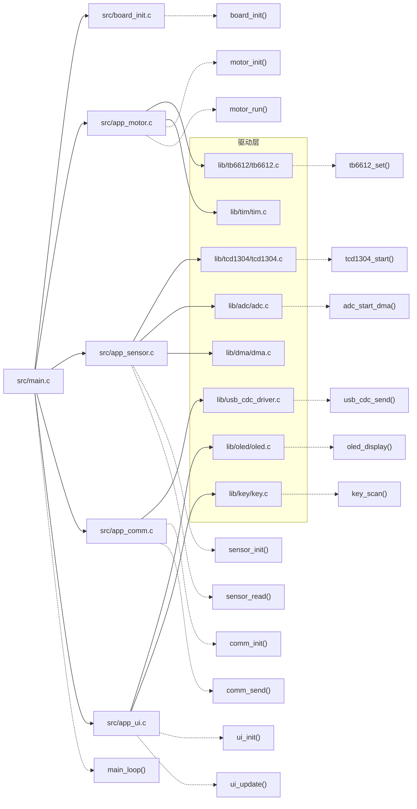
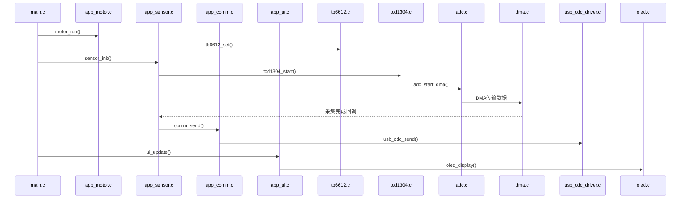
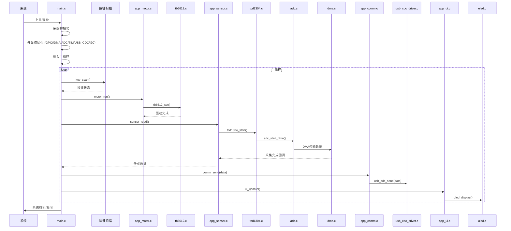

```mermaid
flowchart LR
    %% 顶层结构
    main["src/main.c"]
    board["src/board_init.c"]
    app_motor["src/app_motor.c"]
    app_sensor["src/app_sensor.c"]
    app_comm["src/app_comm.c"]
    app_ui["src/app_ui.c"]

    main --> board
    main --> app_motor
    main --> app_sensor
    main --> app_comm
    main --> app_ui

    subgraph 驱动层
        tb6612["lib/tb6612/tb6612.c"]
        tim["lib/tim/tim.c"]
        tcd1304["lib/tcd1304/tcd1304.c"]
        adc["lib/adc/adc.c"]
        dma["lib/dma/dma.c"]
        usb_cdc_driver["lib/usb_cdc_driver.c"]
        oled["lib/oled/oled.c"]
        key["lib/key/key.c"]
    end

    app_motor --> tb6612
    app_motor --> tim
    app_sensor --> tcd1304
    app_sensor --> adc
    app_sensor --> dma
    app_comm --> usb_cdc_driver
    app_ui --> oled
    app_ui --> key

    %% 主要函数
    main -.-> main_loop["main_loop()"]
    board -.-> board_init["board_init()"]
    app_motor -.-> motor_init["motor_init()"]
    app_motor -.-> motor_run["motor_run()"]
    app_sensor -.-> sensor_init["sensor_init()"]
    app_sensor -.-> sensor_read["sensor_read()"]
    app_comm -.-> comm_init["comm_init()"]
    app_comm -.-> comm_send["comm_send()"]
    app_ui -.-> ui_init["ui_init()"]
    app_ui -.-> ui_update["ui_update()"]
    tb6612 -.-> tb6612_set["tb6612_set()"]
    tcd1304 -.-> tcd1304_start["tcd1304_start()"]
    adc -.-> adc_start_dma["adc_start_dma()"]
    usb_cdc_driver -.-> usb_cdc_send["usb_cdc_send()"]
    oled -.-> oled_display["oled_display()"]
    key -.-> key_scan["key_scan()"]
```

```mermaid
sequenceDiagram
    participant Main as main.c
    participant Motor as app_motor.c
    participant Sensor as app_sensor.c
    participant Comm as app_comm.c
    participant UI as app_ui.c
    participant TB6612 as tb6612.c
    participant TCD1304 as tcd1304.c
    participant ADC as adc.c
    participant DMA as dma.c
    participant USB_CDC as usb_cdc_driver.c
    participant OLED as oled.c

    Main->>Motor: motor_run()
    Motor->>TB6612: tb6612_set()
    Main->>Sensor: sensor_init()
    Sensor->>TCD1304: tcd1304_start()
    TCD1304->>ADC: adc_start_dma()
    ADC->>DMA: DMA传输数据
    DMA-->>Sensor: 采集完成回调
    Sensor->>Comm: comm_send()
    Comm->>USB_CDC: usb_cdc_send()
    Main->>UI: ui_update()
    UI->>OLED: oled_display()
```

```mermaid
sequenceDiagram
    participant SYS   as 系统
    participant MAIN  as main.c
    participant KEY   as 按键扫描
    participant MOTOR as app_motor.c
    participant TB    as tb6612.c
    participant SENSOR as app_sensor.c
    participant TCD   as tcd1304.c
    participant ADC   as adc.c
    participant DMA   as dma.c
    participant COMM  as app_comm.c
    participant USB_VCP as usb_cdc_driver.c
    participant UI    as app_ui.c
    participant OLED  as oled.c

    SYS->>MAIN: 上电/复位
    MAIN->>MAIN: 系统初始化
    MAIN->>MAIN: 外设初始化 (GPIO/DMA/ADC/TIM/USB_CDC/I2C)

    MAIN->>MAIN: 进入主循环
    loop 主循环
        MAIN->>KEY: key_scan()
        KEY-->>MAIN: 按键状态

        MAIN->>MOTOR: motor_run()
        MOTOR->>TB: tb6612_set()
        TB-->>MOTOR: 驱动完成

        MAIN->>SENSOR: sensor_read()
        SENSOR->>TCD: tcd1304_start()
        TCD->>ADC: adc_start_dma()
        ADC->>DMA: DMA传输数据
        DMA-->>SENSOR: 采集完成回调

        SENSOR-->>MAIN: 传感数据

        MAIN->>COMM: comm_send(data)
        COMM->>USB_VCP: usb_cdc_send(data)

        MAIN->>UI: ui_update()
        UI->>OLED: oled_display()

    end
    MAIN->>SYS: 系统待机/关闭
```
