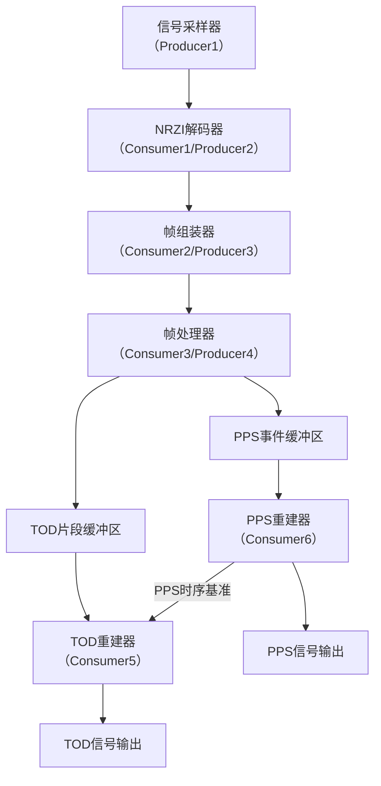
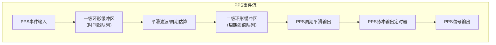
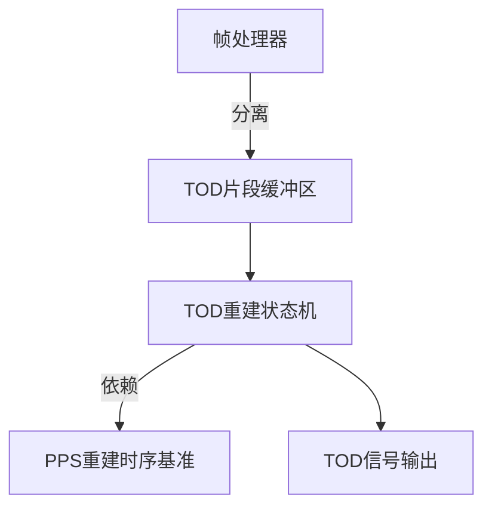
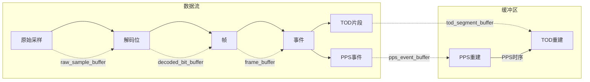

Summarized conversation history好的，下面是一个详细的规划文档草案（.md），包含Mermaid流程图，描述整体生产者-消费者架构、PPS双重环形缓冲区重建、TOD分离与重建流程。你可以直接保存为 `docs/tdm_signal_arch.md` 或类似文件名。

---

# STM32G431C8T6 TDM信号智能处理系统架构说明

## 1. 总体架构（生产者-消费者模型）

- **每一级为上一级的消费者，下一级的生产者。**
- **TOD重建依赖PPS重建的时序基准。**

---

## 2. PPS双重环形缓冲区重建机制

- **一级缓冲区**：记录PPS事件时间戳，滑动窗口去除过旧数据。
- **二级缓冲区**：保存最近N个周期，做平滑滤波，输出平滑周期。
- **定时器**：根据平滑周期输出PPS脉冲，保证时序稳定。

---

## 3. TOD信号分离与重建流程

- **帧处理器**：从TDM帧中分离TOD片段，写入缓冲区。
- **TOD重建状态机**：依赖PPS重建的时序基准，按片段描述重建TOD信号。
- **TOD输出**：保证与PPS时序对齐，完整还原原始TOD信号。

---

## 4. 关键数据流与缓冲区关系

---

## 5. 说明

- **所有缓冲区均为环形队列，内存占用严格受控，适配32KB RAM。**
- **PPS重建采用双重环形缓冲区，保证周期平滑、异常恢复能力强。**
- **TOD重建严格依赖PPS时序，保证信号完整性和对齐。**
- **全链路采用生产者-消费者模型，便于扩展和维护。**

---

> 本文档为后续开发、维护、交流提供架构依据。
> 详细实现请参考 main.cpp、pps重建.cpp、smart_tdm.cpp。

---

如需保存为文件请告知文件名。是否需要补充具体字段说明或流程细节？