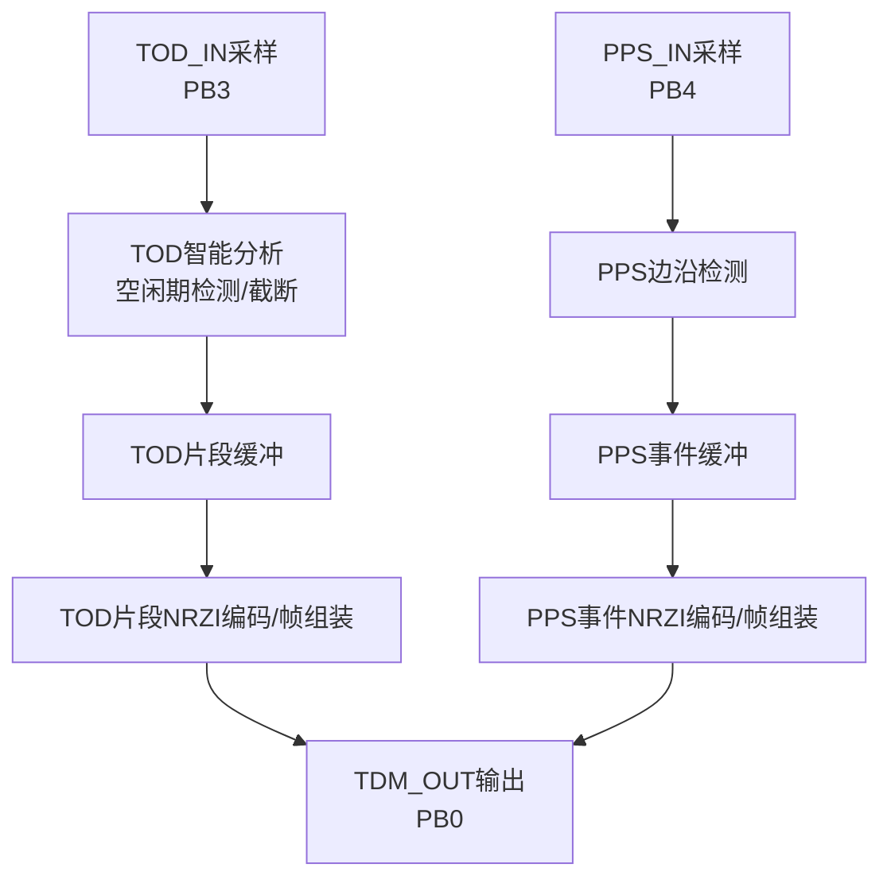
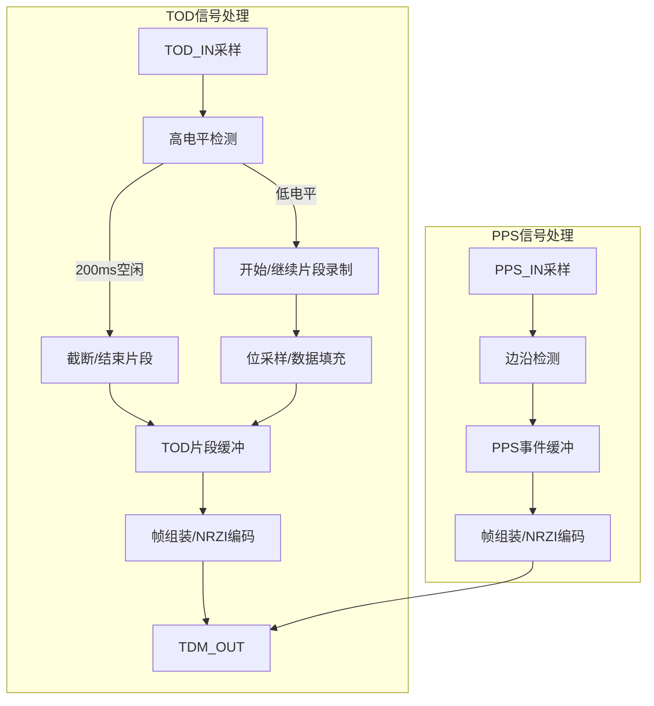

下面是针对 smart_tdm.cpp（信号编码器）的详细程序说明文档草案，包含Mermaid流程图和结构说明，适合保存为 `docs/smart_tdm_encoder.md`。

---

# STM32G431C8T6 智能TDM信号编码器程序说明

## 1. 总体架构与信号流

- TOD与PPS信号分别采样、分析、编码，最终通过TDM_OUT统一输出。

---

## 2. 主要数据结构

- **TODSegment**
  - `start_timestamp`：片段起始时间戳（us）
  - `duration_us`：片段持续时间
  - `bit_count`：片段内有效位数
  - `data[]`：位数据（最大512位）
  - `valid`：片段有效标志

- **PPSEvent**
  - `timestamp`：PPS边沿时间戳
  - `is_rising`：上升沿/下降沿
  - `valid`：事件有效标志

- **SmartTDMFrame**
  - `sync_header`：同步头0x5A
  - `frame_type`：帧类型（TOD片段/PPS事件/混合）
  - `sequence`：帧序号
  - `timestamp`：帧时间戳
  - `payload_length`：载荷长度
  - `payload[]`：变长载荷（TOD片段或PPS事件）
  - `crc`：CRC校验

---

## 3. 编码流程与缓冲机制

- TOD片段与PPS事件分别缓冲，统一帧格式编码后NRZI输出。

---

## 4. 关键算法与创新点

- **TOD智能截断**：检测200ms连续高电平自动截断，空闲期不编码，极大压缩数据量。
- **PPS事件捕获**：边沿检测+时间戳，事件实时编码，保证时序完整。
- **双层缓冲**：TOD片段与PPS事件各自环形缓冲，防止丢失。
- **NRZI编码**：所有帧统一NRZI编码，抗干扰强，便于解码。
- **CRC校验**：每帧独立CRC，提升链路健壮性。
- **统计输出**：定期串口输出编码效率、节省字节数等统计信息。

---

## 5. 主要流程说明

- **采样与分析**：定时采样TOD/PPS输入，分别分析高电平/边沿。
- **TOD片段录制**：低电平期间采样位，遇高电平或空闲期自动截断。
- **PPS事件捕获**：检测到电平变化即记录事件，带时间戳。
- **帧组装与发送**：TOD片段和PPS事件均组装为SmartTDMFrame，NRZI编码后输出。
- **统计与调试**：每5秒串口输出一次统计信息，便于性能评估。

---

## 6. 资源与接口

- **输入**：
  - PB3: TOD_IN
  - PB4: PPS_IN
- **输出**：
  - PB0: TDM_OUT（NRZI编码TDM信号）
  - PA2/PA3: 串口调试输出

---

> 本文档为编码器端开发、维护、交流提供架构与流程依据。
> 详细实现请参考 smart_tdm.cpp。

---

如需保存为文件请告知文件名，或如需补充具体字段/流程细节请说明。